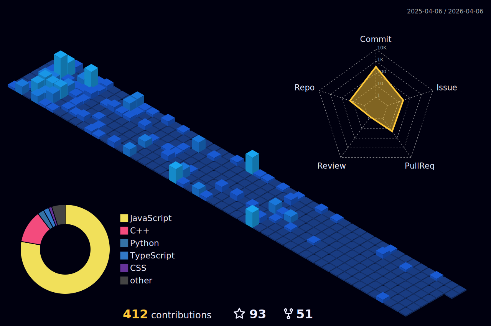

<p align="center">
  
</p>
<h1> Hello Fellow < Coders/ >!  </h1>
<p align='center'>

</p>
<p align='center'>
</img></p>
<hr>
<br>
<p align='center'>
&nbsp;&nbsp;&nbsp;&nbsp;
&nbsp;&nbsp;&nbsp;&nbsp;
<!--  -->
</p>
<br>

## npm package - Profile card 📦 
<br>

> Run the following command to know more about me

<br> 

```
npx chinmay29hub
```

<hr>
<br>

## Github Contribution Streak 🔥 
<br>
<p align='center'></p>

<hr><br>

## Github Stats &nbsp;📊
<br>
<p align='center'>

</p>
<hr>
<br>

## Most Used Languages 📚
<br>
<p align='center'>

</p>
<p align='center'>
<h6>Note : Does not indicate my skill level or anything like that, it's a GitHub metric of which languages have the most code on GitHub.</h6>
</p>

<hr>
<br>

## 3D Contribution Calendar 📅
<br>
<p align='center'>

</p>
<hr>
<br>

## Technology Stack 💻

<p align='center'>
</img></p>

### Languages, Frameworks, Platforms and Libraries 🖥 :
<br>
<p align='center'>
&nbsp;&nbsp;
&nbsp;&nbsp;
&nbsp;&nbsp;
&nbsp;&nbsp;
&nbsp;&nbsp;
&nbsp;&nbsp;
&nbsp;&nbsp;
&nbsp;&nbsp;
&nbsp;&nbsp;
&nbsp;&nbsp;
&nbsp;&nbsp;
&nbsp;&nbsp;
&nbsp;&nbsp;
&nbsp;&nbsp;
&nbsp;&nbsp;
&nbsp;&nbsp;
&nbsp;&nbsp;
&nbsp;&nbsp;
&nbsp;&nbsp;
&nbsp;&nbsp;
&nbsp;&nbsp;
&nbsp;&nbsp;
&nbsp;&nbsp;
</p>
<br>

### Design 🎨 :
<br>
<p align='center'>
&nbsp;&nbsp;
&nbsp;&nbsp;
&nbsp;&nbsp;

</p>
<br>

### IDEs/Editors 👨‍🔧 :
<br>
<p align="center">
&nbsp;&nbsp;
&nbsp;&nbsp;
&nbsp;&nbsp;
&nbsp;&nbsp;
&nbsp;&nbsp;
&nbsp;&nbsp;
&nbsp;&nbsp;
&nbsp;&nbsp;
&nbsp;&nbsp;
&nbsp;&nbsp;
&nbsp;&nbsp;
</p>
<br>

### Version Control 🔧 :
<br>
<p align='center'>
&nbsp;&nbsp;
&nbsp;&nbsp;
&nbsp;&nbsp;
</p>
<br>

### Social Media 🔗 :
<br>
<p align='center'>
<a href="mailto:chinmaysonawane57@gmail.com" target="_blank">

</a>&nbsp;&nbsp;
<a href="https://www.instagram.com/chinmay_sonawane57" target="_blank">
</a>&nbsp;&nbsp;
<a href="https://www.linkedin.com/in/chinmay-sonawane-38474019a/" target="_blank">
</a>&nbsp;&nbsp;
<a href="mailto:chinmaysonawane57@protonmail.com" target="_blank">
</a>&nbsp;&nbsp;
<a href="https://www.reddit.com/user/chinmay29hub" target="_blank">
</a>&nbsp;&nbsp;
<a href="https://www.youtube.com/channel/UCfc0iDwzZi7CLKIBWBCJNWw">

</a>&nbsp;&nbsp;
</p>
<br>

### Hosting/Cloud Services ☁️ :
<br>
<p align='center'>
</img></p>
<br>
<p align='center'>
&nbsp;&nbsp;
&nbsp;&nbsp;
&nbsp;&nbsp;
&nbsp;&nbsp;
&nbsp;&nbsp;
&nbsp;&nbsp;
&nbsp;&nbsp;
&nbsp;&nbsp;
&nbsp;&nbsp;
&nbsp;&nbsp;
&nbsp;&nbsp;
</p>

<br>

### Servers 🖥 :
<br>
<p align='center'>
&nbsp;&nbsp;
&nbsp;&nbsp;
&nbsp;&nbsp;
</p>
<br>

<br>

### Database 💾 :
<br>
<p align='center'>
&nbsp;&nbsp;
&nbsp;&nbsp;
&nbsp;&nbsp;
&nbsp;&nbsp;
&nbsp;&nbsp;
&nbsp;&nbsp;
&nbsp;&nbsp;
</p>

<br>

### IOT 🔌 :
<br>
<p align='center'>
</img></p>
<br>
<p align='center'>

</p>
<br>

### Operating Systems 🐧 :
<br>
<p align='center'>
</img></p>
<br>
<p align='center'>
&nbsp;&nbsp;
&nbsp;&nbsp;
&nbsp;&nbsp;
&nbsp;&nbsp;
&nbsp;&nbsp;
&nbsp;&nbsp;
&nbsp;&nbsp;
</p>
<hr>
<br>

## Github Contributions 📈
<br>
<p align='center'>

<p>

<hr>
<br>

## Just a snake eating my contributions 🐍
<p align='center'>
<picture>
  <source
    media="(prefers-color-scheme: dark)"
    srcset="https://raw.githubusercontent.com/chinmay29hub/chinmay29hub/output/github-contribution-grid-snake-dark.svg"
  />
  <source
    media="(prefers-color-scheme: light)"
    srcset="https://raw.githubusercontent.com/chinmay29hub/chinmay29hub/output/github-contribution-grid-snake.svg"
  />
  
</picture>

</p>

<hr>
<br>

## Waka Time Stats 🕰
<br>

<!--START_SECTION:waka-->


**🐱 My GitHub Data** 

> 📦 462.8 kB Used in GitHub's Storage 
 > 
> 🏆 98 Contributions in the Year 2025
 > 
> 🚫 Not Opted to Hire
 > 
> 📜 68 Public Repositories 
 > 
> 🔑 25 Private Repositories 
 > 
**I'm an Early 🐤** 

```text
🌞 Morning                1731 commits        ██████░░░░░░░░░░░░░░░░░░░   22.43 % 
🌆 Daytime                2508 commits        ████████░░░░░░░░░░░░░░░░░   32.50 % 
🌃 Evening                2764 commits        █████████░░░░░░░░░░░░░░░░   35.82 % 
🌙 Night                  713 commits         ██░░░░░░░░░░░░░░░░░░░░░░░   09.24 % 
```
📅 **I'm Most Productive on Saturday** 

```text
Monday                   518 commits         ██░░░░░░░░░░░░░░░░░░░░░░░   06.71 % 
Tuesday                  1242 commits        ████░░░░░░░░░░░░░░░░░░░░░   16.10 % 
Wednesday                762 commits         ██░░░░░░░░░░░░░░░░░░░░░░░   09.88 % 
Thursday                 791 commits         ███░░░░░░░░░░░░░░░░░░░░░░   10.25 % 
Friday                   358 commits         █░░░░░░░░░░░░░░░░░░░░░░░░   04.64 % 
Saturday                 2575 commits        ████████░░░░░░░░░░░░░░░░░   33.37 % 
Sunday                   1470 commits        █████░░░░░░░░░░░░░░░░░░░░   19.05 % 
```


📊 **This Week I Spent My Time On** 

```text
🕑︎ Time Zone: Asia/Kolkata

💬 Programming Languages: 
JavaScript               10 hrs 24 mins      ██████████████░░░░░░░░░░░   54.93 % 
Markdown                 3 hrs 19 mins       ████░░░░░░░░░░░░░░░░░░░░░   17.52 % 
JSON                     1 hr 40 mins        ██░░░░░░░░░░░░░░░░░░░░░░░   08.82 % 
YAML                     1 hr 10 mins        ██░░░░░░░░░░░░░░░░░░░░░░░   06.17 % 
HTML                     46 mins             █░░░░░░░░░░░░░░░░░░░░░░░░   04.10 % 

🔥 Editors: 
VS Code                  18 hrs 57 mins      █████████████████████████   100.00 % 

🐱‍💻 Projects: 
haiku-readme             8 hrs 47 mins       ████████████░░░░░░░░░░░░░   46.35 % 
abm-salary-app           8 hrs 14 mins       ███████████░░░░░░░░░░░░░░   43.43 % 
chinmay29hub             1 hr 37 mins        ██░░░░░░░░░░░░░░░░░░░░░░░   08.57 % 
quiz-bot                 18 mins             ░░░░░░░░░░░░░░░░░░░░░░░░░   01.65 % 

💻 Operating System: 
Windows                  18 hrs 57 mins      █████████████████████████   100.00 % 
```

**I Mostly Code in JavaScript** 

```text
JavaScript               30 repos            █████████░░░░░░░░░░░░░░░░   34.09 % 
Python                   29 repos            ████████░░░░░░░░░░░░░░░░░   32.95 % 
HTML                     6 repos             ██░░░░░░░░░░░░░░░░░░░░░░░   06.82 % 
C#                       3 repos             █░░░░░░░░░░░░░░░░░░░░░░░░   03.41 % 
TeX                      1 repo              ░░░░░░░░░░░░░░░░░░░░░░░░░   01.14 % 
```


 Last Updated on 23/04/2025 02:03:17 UTC
<!--END_SECTION:waka-->

<hr>
<br>

## Trophies 🏆:
<br>
<p align='center'>

</p>
<hr>
<br>

## Recent Articles on Medium 📚 :
<br>
<p>

</p>
<br>
<p>

</p>
<br>
<p>

</p>
<br>
<p>

</p>
<br>
<p>

</p>
<br>

<hr>
<br>

## Articles On linuxfordevices.com 🐧 :
<br>

| Clickable Titles |
| --- |
| [Cool Terminal Progress Bar – Python and Bash](https://www.linuxfordevices.com/tutorials/linux/terminal-progress-bar-python-bash) |
| [Top 10 Amazing Raspberry Pi Projects 2022](https://www.linuxfordevices.com/tutorials/linux/top-raspberry-pi-projects) |
| [9 Best Linux Distros For Programming](https://www.linuxfordevices.com/tutorials/linux/best-linux-distros-for-programming) |
| [Kubuntu vs Ubuntu – Which is the best 2022?](https://www.linuxfordevices.com/tutorials/ubuntu/kubuntu-vs-ubuntu) |
| [Make Your Arch Linux Terminal Awesome 2022](https://www.linuxfordevices.com/tutorials/linux/make-arch-terminal-awesome) |
| [9 Best Widgets For KDE Plasma](https://www.linuxfordevices.com/tutorials/linux/best-widgets-for-kde-plasma) |
| [Best Way To Connect Raspberry Pi Remotely 2022](https://www.linuxfordevices.com/tutorials/linux/connect-raspberry-pi-remotely) |
| [Settings To Make Your KDE Desktop Stunning 2022](https://www.linuxfordevices.com/tutorials/linux/make-kde-desktop-stunning) |
| [Draw On Your Linux Screen With These Great Tools 2022](https://www.linuxfordevices.com/tutorials/linux/tools-to-draw-on-linux-screen) |
| [Best Way To Execute Linux Commands using Python](https://www.linuxfordevices.com/tutorials/linux/execute-linux-commands-python) |
| [How to download and Play Among us On Linux?](https://www.linuxfordevices.com/tutorials/linux/among-us-on-linux) |
| [Make Your Bash Shell Beautiful 2022](https://www.linuxfordevices.com/tutorials/linux/beautify-bash-shell) |
| [A great way to use Ubuntu Server 22.04 on Virtual Box](https://www.linuxfordevices.com/tutorials/linux/ubuntu-server-on-virtual-box) |

<hr>
<br>

## Articles on codeforgeek.com 💻 :
<br>

| Clickable Titles |
| --- |
| [Upgrade Your Raspberry Pi to a Powerful Web Server](https://codeforgeek.com/raspberry-pi-webserver/) |

<hr>
<br>

## Articles on ubuntumint.com 🐧 :

| Clickable Titles |
| --- |
| [8 CLI + GUI System Information Tools for Ubuntu](https://www.ubuntumint.com/ubuntu-system-information-tools/) |
| [How to Enable or Disable IPv6 in NGINX](https://www.ubuntumint.com/disable-ipv6-nginx/) |
| [6 Best Ubuntu Screenshot Tools](https://www.ubuntumint.com/ubuntu-screenshot-tools/) |
| [How To Check Your Ubuntu Version Using CLI and GUI](https://www.ubuntumint.com/check-ubuntu-version/) |
| [How to Disable/Enable CPU Cores in Ubuntu](https://www.ubuntumint.com/disable-cpu-cores-ubuntu/) |
| [How to Check CPU Cores in Ubuntu](https://www.ubuntumint.com/check-ubuntu-cpu-cores/) |
| [How to Install Zsh + Oh My Zsh + Powerlevel10k Theme in Ubuntu](https://www.ubuntumint.com/install-zsh-oh-my-zsh-powerlevel10k-ubuntu/) |
| [How to Install Media Codecs in Ubuntu](https://www.ubuntumint.com/install-ubuntu-codecs/) |
| [How to Enable SSH on Ubuntu](https://www.ubuntumint.com/enable-ssh-on-ubuntu/) |


<!-- <hr>
<br>

## chinmay29hub 2021 📅:
<br>
<p align='center'>

</p> -->

<hr>
<br>

## Dynamic Quotes 📜:
<br>
<p align='center'>

</p>
<hr>
<br>
<h2 align='center'>Support Me By Starring ⭐ Some Of My Repositories</h2>
<br>

<p align='center'>
</img></p>
<br>

<h2 align='center'>Thank You!!!!!</h2>
<br>
<p align="center">
  
</p>
