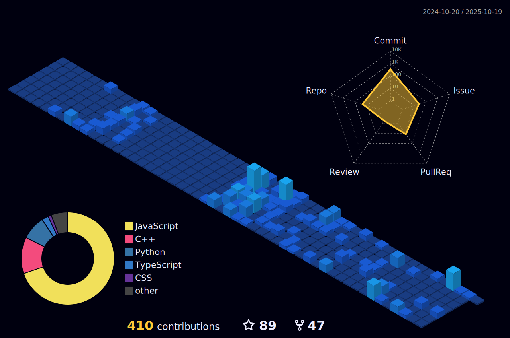

<p align="center">
  
</p>
<h1> Hello Fellow < Coders/ >!  </h1>
<p align='center'>

</p>
<p align='center'>
</img></p>
<hr>
<br>
<p align='center'>
&nbsp;&nbsp;&nbsp;&nbsp;
&nbsp;&nbsp;&nbsp;&nbsp;
<!--  -->
</p>
<br>

## npm package - Profile card 📦 
<br>

> Run the following command to know more about me

<br> 

```
npx chinmay29hub
```

<hr>
<br>

## Github Contribution Streak 🔥 
<br>
<p align='center'></p>

<hr><br>

## Github Stats &nbsp;📊
<br>
<p align='center'>

</p>
<hr>
<br>

## Most Used Languages 📚
<br>
<p align='center'>

</p>
<p align='center'>
<h6>Note : Does not indicate my skill level or anything like that, it's a GitHub metric of which languages have the most code on GitHub.</h6>
</p>

<hr>
<br>

## 3D Contribution Calendar 📅
<br>
<p align='center'>

</p>
<hr>
<br>

## Technology Stack 💻

<p align='center'>
</img></p>

### Programming Languages 👨‍💻 :
<br>
<p align='center'>
&nbsp;&nbsp;
&nbsp;&nbsp;
&nbsp;&nbsp;
&nbsp;&nbsp;
&nbsp;&nbsp;
&nbsp;&nbsp;
</p>
<br>

### Web Development 🌐 :
<br>
<p align='center'>
&nbsp;&nbsp;
&nbsp;&nbsp;
&nbsp;&nbsp;
&nbsp;&nbsp;
&nbsp;&nbsp;
</p>
<br>

### Frameworks & Libraries 📦 :
<br>
<p align='center'>
&nbsp;&nbsp;
&nbsp;&nbsp;
<!-- &nbsp;&nbsp;
&nbsp;&nbsp;
&nbsp;&nbsp; -->
</p>
<br>

### Design 🎨 :
<br>
<p align='center'>
&nbsp;&nbsp;
&nbsp;&nbsp;
</p>
<br>

### IDEs/Editors 👨‍🔧 :
<br>
<p align="center">
&nbsp;&nbsp;
&nbsp;&nbsp;
&nbsp;&nbsp;
&nbsp;&nbsp;
&nbsp;&nbsp;
&nbsp;&nbsp;
</p>
<br>

### Version Control 🔧 :
<br>
<p align='center'>
&nbsp;&nbsp;
&nbsp;&nbsp;
</p>
<br>

### Social Media 🔗 :
<br>
<p align='center'>
<a href="mailto:chinmaysonawane57@gmail.com" target="_blank">

</a>&nbsp;&nbsp;
<a href="https://www.instagram.com/chinmay29hub" target="_blank">
</a>&nbsp;&nbsp;
<a href="https://www.linkedin.com/in/chinmay-sonawane-38474019a/" target="_blank">
</a>&nbsp;&nbsp;
<a href="mailto:chinmaysonawane57@protonmail.com" target="_blank">
</a>&nbsp;&nbsp;
<a href="https://www.reddit.com/user/chinmay29hub" target="_blank">
</a>&nbsp;&nbsp;
<a href="https://www.youtube.com/channel/UCfc0iDwzZi7CLKIBWBCJNWw">

</a>&nbsp;&nbsp;
</p>
<br>

### Hosting 🌎 :
<br>
<p align='center'>
</img></p>
<br>
<p align='center'>
&nbsp;&nbsp;
&nbsp;&nbsp;
&nbsp;&nbsp;
</p>
<br>

<!-- ### Server 🗃️ :
<br>
<p align='center'>

</p>
<br> -->

<br>

### Database 💾 :
<br>
<p align='center'>
&nbsp;&nbsp;
&nbsp;&nbsp;
</p>
<br>

<!-- ### ML/DL 🤖/🧠 :
<br>
<p align='center'>
</img></p>
<br>
<p align='center'>
&nbsp;&nbsp;
&nbsp;&nbsp;
&nbsp;&nbsp;
</p> -->
<br>

### IOT 🔌 :
<br>
<p align='center'>
</img></p>
<br>
<p align='center'>

</p>
<br>

### Operating Systems 🐧 :
<br>
<p align='center'>
</img></p>
<br>
<p align='center'>
&nbsp;&nbsp;
&nbsp;&nbsp;
&nbsp;&nbsp;
&nbsp;&nbsp;
&nbsp;&nbsp;
&nbsp;&nbsp;
&nbsp;&nbsp;
</p>
<hr>
<br>

## Github Contributions 📈
<br>
<p align='center'>

<p>

<hr>
<br>

## Just a snake eating my contributions 🐍
<p align='center'>

</p>

<hr>
<br>

## Waka Time Stats 🕰
<br>

<!--START_SECTION:waka-->


**🐱 My GitHub Data** 

> 📦 302.6 kB Used in GitHub's Storage 
 > 
> 🏆 415 Contributions in the Year 2023
 > 
> 🚫 Not Opted to Hire
 > 
> 📜 59 Public Repositories 
 > 
> 🔑 3 Private Repositories 
 > 
**I'm an Early 🐤** 

```text
🌞 Morning                193 commits         █████░░░░░░░░░░░░░░░░░░░░   19.86 % 
🌆 Daytime                346 commits         █████████░░░░░░░░░░░░░░░░   35.60 % 
🌃 Evening                394 commits         ██████████░░░░░░░░░░░░░░░   40.53 % 
🌙 Night                  39 commits          █░░░░░░░░░░░░░░░░░░░░░░░░   04.01 % 
```
📅 **I'm Most Productive on Saturday** 

```text
Monday                   122 commits         ███░░░░░░░░░░░░░░░░░░░░░░   12.55 % 
Tuesday                  142 commits         ████░░░░░░░░░░░░░░░░░░░░░   14.61 % 
Wednesday                157 commits         ████░░░░░░░░░░░░░░░░░░░░░   16.15 % 
Thursday                 88 commits          ██░░░░░░░░░░░░░░░░░░░░░░░   09.05 % 
Friday                   113 commits         ███░░░░░░░░░░░░░░░░░░░░░░   11.63 % 
Saturday                 177 commits         █████░░░░░░░░░░░░░░░░░░░░   18.21 % 
Sunday                   173 commits         ████░░░░░░░░░░░░░░░░░░░░░   17.80 % 
```


📊 **This Week I Spent My Time On** 

```text
🕑︎ Time Zone: Asia/Kolkata

💬 Programming Languages: 
No Activity Tracked This Week

🔥 Editors: 
No Activity Tracked This Week

🐱‍💻 Projects: 
No Activity Tracked This Week

💻 Operating System: 
No Activity Tracked This Week
```

**I Mostly Code in JavaScript** 

```text
JavaScript               21 repos            ████████░░░░░░░░░░░░░░░░░   33.87 % 
Python                   21 repos            ████████░░░░░░░░░░░░░░░░░   33.87 % 
Jupyter Notebook         7 repos             ███░░░░░░░░░░░░░░░░░░░░░░   11.29 % 
CSS                      5 repos             ██░░░░░░░░░░░░░░░░░░░░░░░   08.06 % 
C                        1 repo              ░░░░░░░░░░░░░░░░░░░░░░░░░   01.61 % 
```


 Last Updated on 12/08/2023 06:21:09 UTC
<!--END_SECTION:waka-->

<hr>
<br>

## Trophies 🏆:
<br>
<p align='center'>

</p>
<hr>
<br>

## Recent Articles on Medium 📚 :
<br>
<p>

</p>
<br>
<p>

</p>
<br>
<p>

</p>
<br>
<p>

</p>
<br>
<p>

</p>
<br>

<hr>
<br>

## Articles On linuxfordevices.com 🐧 :
<br>

| Clickable Titles |
| --- |
| [Cool Terminal Progress Bar – Python and Bash](https://www.linuxfordevices.com/tutorials/linux/terminal-progress-bar-python-bash) |
| [Top 10 Amazing Raspberry Pi Projects 2022](https://www.linuxfordevices.com/tutorials/linux/top-raspberry-pi-projects) |
| [9 Best Linux Distros For Programming](https://www.linuxfordevices.com/tutorials/linux/best-linux-distros-for-programming) |
| [Kubuntu vs Ubuntu – Which is the best 2022?](https://www.linuxfordevices.com/tutorials/ubuntu/kubuntu-vs-ubuntu) |
| [Make Your Arch Linux Terminal Awesome 2022](https://www.linuxfordevices.com/tutorials/linux/make-arch-terminal-awesome) |
| [9 Best Widgets For KDE Plasma](https://www.linuxfordevices.com/tutorials/linux/best-widgets-for-kde-plasma) |
| [Best Way To Connect Raspberry Pi Remotely 2022](https://www.linuxfordevices.com/tutorials/linux/connect-raspberry-pi-remotely) |
| [Settings To Make Your KDE Desktop Stunning 2022](https://www.linuxfordevices.com/tutorials/linux/make-kde-desktop-stunning) |
| [Draw On Your Linux Screen With These Great Tools 2022](https://www.linuxfordevices.com/tutorials/linux/tools-to-draw-on-linux-screen) |
| [Best Way To Execute Linux Commands using Python](https://www.linuxfordevices.com/tutorials/linux/execute-linux-commands-python) |
| [How to download and Play Among us On Linux?](https://www.linuxfordevices.com/tutorials/linux/among-us-on-linux) |
| [Make Your Bash Shell Beautiful 2022](https://www.linuxfordevices.com/tutorials/linux/beautify-bash-shell) |
| [A great way to use Ubuntu Server 22.04 on Virtual Box](https://www.linuxfordevices.com/tutorials/linux/ubuntu-server-on-virtual-box) |

<hr>
<br>

## Articles on codeforgeek.com 💻 :
<br>

| Clickable Titles |
| --- |
| [Upgrade Your Raspberry Pi to a Powerful Web Server](https://codeforgeek.com/raspberry-pi-webserver/) |

<hr>
<br>

## chinmay29hub 2021 📅:
<br>
<p align='center'>

</p>

<hr>
<br>

## Dynamic Quotes 📜:
<br>
<p align='center'>

</p>
<hr>
<br>
<h2 align='center'>Support Me By Starring ⭐ Some Of My Repositories</h2>
<br>

<p align='center'>
</img></p>
<br>

<h2 align='center'>Thank You!!!!!</h2>
<br>
<p align="center">
  
</p>
